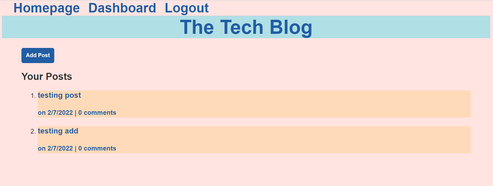

# Tech-Blog

## Description

A CMS-style blog site, allow user to publish articles, blog posts, and my thoughts and opinions.

## Table of Contents

* [Installation](#installation)
* [Usage](#usage)
* [Features](#features)
* [Credits](#credits)
* [Results](#results)
* [Screenshots](#screenshots)

## Installation

To install necessary dependencies, run the following commands in command line:
npm i

To create the database, run the following commands in mysql shell:
source db/schema.sql

## Usage

To use the application, run the following commands:
npm start

## Features

1. Signup users
2. Login with encrypted password
3. Add, Edit, Delete Posts
4. Add Comments
5. Auto Logout after cookies expiring time

## Credits

Third-Party Assets:
1. dotenv
2. MySQL2
3. Sequelize
4. Session
5. bcrypt
6. JawsDB

## Results

Application: https://frozen-retreat-94147.herokuapp.com/

Repository: https://github.com/pc611652003/Tech-Blog

## Screenshot

After user go to the application, they are presented the homepage displaying all posts

If user is not signed up or logged in, any link will direct user to login page

After user signed up or logged in, user will redirect to homepage

User can click on the title of any post, to see all comments and add comment

User can view all their posts by going to dashboard

User can click on the add post button to add new post

User can click on any post on their dashboard to edit or delete post

User will automatically logged out after 15 mins
